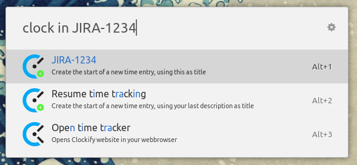
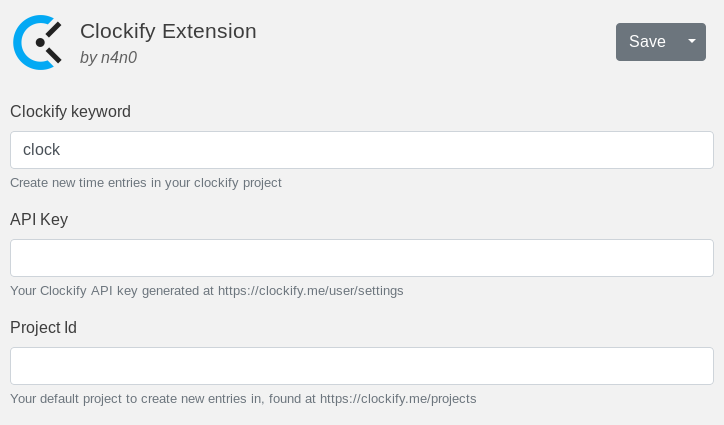

# UlauncherClockify
A Clockify extension for Ulauncher.

## Install
* Open Ulauncher preferences
* Go to 'extensions'
* Click on 'add extension'
* Paste `https://github.com/n4n0GH/ulauncher_clockify` and confirm

## Setup
You're going to be copypasting a few things from the Clockify website into the extension's settings. So open up the Ulauncher preferences window and go to the extensions tab, then select the Clockify extension.

### API Key & Project Id
Since this is supposed to communicate with an API, we need some basic information.

Go to https://clockify.me/user/settings and scroll down until you can see 'API Key'. Click the generate button and copy that fresh API Key into the Ulauncher extension settings where it says 'API Key'. Don't worry, it stays on your machine.

Next up you need a default project to create new entries in. Head over to https://clockify.me/projects and just click on the one you think makes the most sense. Once the page has loaded take a look at the URL in your browser. It should look like `https://clockify.me/projects/YOUR-CRYPTIC-ID-HERE/edit`. Copy that Id part into the Ulauncher extension settings where it says 'Project Id'.

Now hit the 'Save' button on top and you're all set up!

## Usage
Invoke the extension with the default keyword `clock`.

Basic command structure is like so: `clock (in[ <title>|out[ <title>]|status)`.

`<title>` can contain tags. For example `clock in #call foo` will create a new time entry with the title `foo` and assign the `call` tag to it. If you need to use `#` in the title you can escape it by `\#`. Tag name is one word which can contain letters, numbers, `-`, and `_`. You can use multiple tags, it doesn't matter where in the title you use them. 

`<title>` can contain a project name. For example `clock in foo @project` will create a new time entry with the title `foo` in the project `project`. If you need to use `@` in the title, you can escape it by `\@`. The project name is case insensitive and does not suppport spaces. The first matching project will be choosen, so letters from the end of the project name can be left out. However, beware of projects starting with the same letters.

### Creating new time entries
Using `clock in` will fetch the title, tags and project of your most recent time entry and re-use that.

`clock in foo` will create a new time entry with the title `foo` in your default project.

 

### Stopping time entries
`clock out` will stop any ongoing time tracking.

`clock out <title>` will update the title (and project and tags) before stopping the ongoing time tracking. This is useful because sometimes the title of the entry is only clear at the end of it. 

### Status of current time entry
`clock status` will show you the title and duration fo your currently running time entry.
